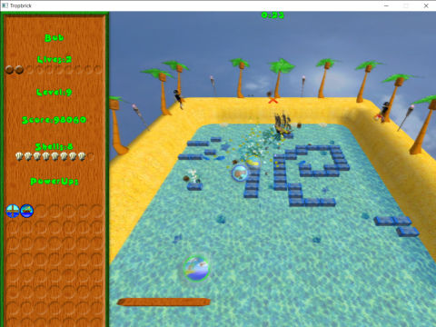

# Tropbrick

## A Tropical Themed Brick Breaking Game

This game was created by a friend and me back in high school.  It is built in Blitz3D, which is now available as an open source IDE [here](https://github.com/blitz-research/blitz3d).

The goal of the game is to break all of the bricks, or treasure chests, using the ball, or coconut, as fast as you can to get the most points without losing all of your lives.  The velocity of the ball can be adjusted slightly by moving the paddle as you hit the ball.  There are various power ups that drop down after breaking bricks that can help you win the game.

If you want to build the code yourself, you can open main.bb in Blitz3D and run or compile it.  Make sure debug mode is disabled because it makes the game run too slow.

### Known Issues

* The game appears to run fine in windowed mode, but when I switched to full screen, the game crashed.
* The delete button does not appear to work properly in the load game screen.

### Credits

The game uses the B3D Extensions, Devil Particle System, Devil Shadow System, and Juicy Fonts libraries along with some other code pulled from the Blitz3D included code.  Music is from www.incompetech.com.  Art is by Jesse Hagerman, some is from the assets included with Blitz3D, a couple of textures came from CGTextures, other art is by me.  Sound effects are from Jesse Hagerman.

